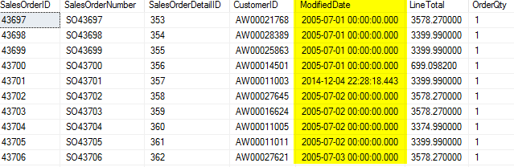
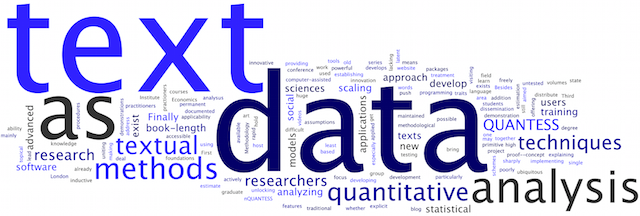
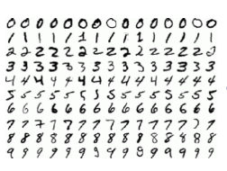

## **Types of Data Available**

Whenever you get any dataset, data can be divided into few categories:

- Numerical Data
- Categorical Data
- Date-time Data
- Text Data
- Image Data

------

### Numerical Data

Data available as direct numbers can be called as numerical data (Note - Sometimes even the columns with numbers can be treated as categorical). Numerical data can be of 2 types:

- Continuous Data

  When we have data that can have continuous values (Decimals are also taken into consideration), Eg - Weight (Can have continuous values).

- Discrete Data

  This one is just the opposite.

  Eg - Number of proxies given by a student (Some would have 1, 2, 5 etc, but never 1.25 proxies, though most have 0 :stuck_out_tongue_winking_eye:) 

------

### Categorical Data

- Nominal Data

  When data is available as categories but there is no ordering between the categories, then it can be called a categorical data.

  

  Eg - Say we have all these colours and you have to tell your fav one. So this information is categorical and even cannot be ranked and hence nominal.

- Ordinal Data

  These are also categorical data but we can rank them in someway.

  Eg - Let's say education column in a dataset contains categories High School, Bachelor, Post Grad., PHD now this data can be ranked as High School < Bachelor < Post Grad. < PHD according to level of education.

  *Assignment* - 

  *Decide Whether these are nominal or ordinal:*

  - *Number of Cars a person has*
  - *Age category people lie in*

------

### Date Time Data

Many times such kind of data containing information about date and/or time of the event are mentioned in the dataset. If properly manipulated we can gain very important insights from these data.

Note - We can use datetime data to generate new information such as Month of the event, Season of the event etc.

------

### Text Data

I don't think that we need to speak much about this type of data.

Eg - Reviews of the customer is one of the most popular examples you would have heard of.

*Note - There are even some situations where you can get more than 1 language in a dataset and you have to use them as input.* This won't be much important right now, but I faced such situation so I thought of mentioning it.

------

### Image Data

In many of the situations you get images as input and you have to use this image for classification purpose.

Now, any image is actually a matrix of the colour intensities (RGB or Greyscale), information from these matrix is actually used for the prediction purposes.

------

:tada: And this is the end of this tutorial.

A tutorial by @[krototype](https://github.com/krototype). 

Open for suggestions. :smile:
